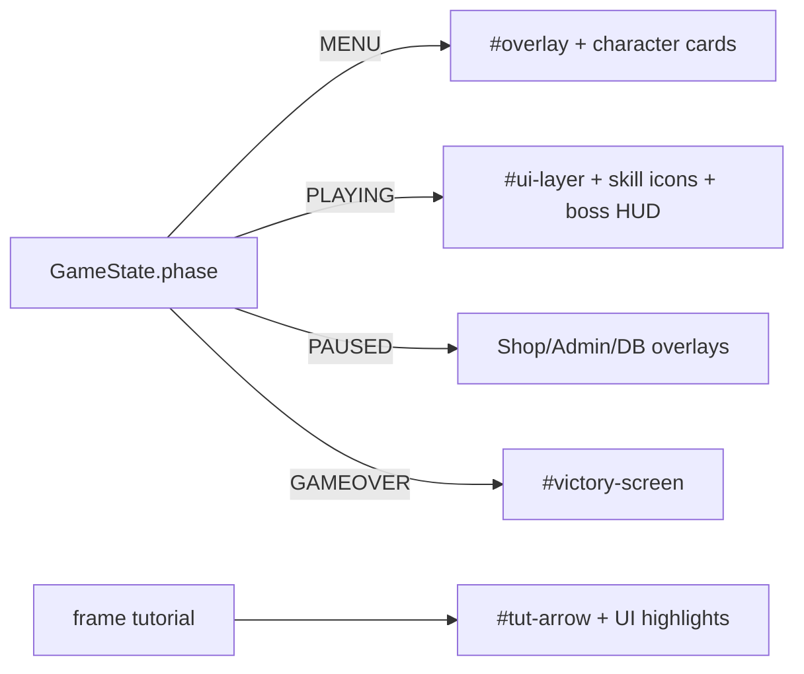

## Goals

- Make all UI (website/game overlays, menus, modals, buttons, HUD surfaces) look “handmade”: cohesive typography/spacing and motion that feels intentional (less robotic shimmer, more consistent easing/choreography).
- Fully preserve the game’s existing identity: keep the current sci‑fi/military visual language, palette, and stable DOM handles that the game logic depends on.
- Guarantee stability: no changes to gameplay simulation/update rules or phase/state machine; avoid breaking `window.*` contracts and element IDs/classes referenced by JS.

## Non-negotiable stability guardrails

- Never rename/remove stable DOM ids/classes used as JS handles (examples confirmed in code): `#overlay`, `#ui-layer`, `#boss-hud`, `#shop-modal`, `#admin-console`, `#achievements-modal`, `#victory-screen`, skill icon ids created/used by `UIManager.setupCharacterHUD()`, mobile buttons `#btn-*`.
- Keep draw/update separation intact: gameplay `draw()` must remain read-only; UI renderers remain consumers.
- Prefer CSS-only improvements (opacity/transform) over layout-changing animation. Where DOM reads are required (tutorial arrow), throttle and cache to prevent reflow spikes.
- Respect existing `prefers-reduced-motion` support and extend it to any new/adjusted animations.

## Scope map (what gets improved)

- `index.html`: keep the same DOM structure/handles; only adjust markup minimally if needed for accessibility (e.g., `aria-label` on buttons) and animation hooks.
- `css/main.css`: unify button/card/modal styling and motion choreography (durations/easing, focus/hover/pressed states, reduce constant shimmer).
- `js/menu.js`: smooth character selection feedback (primarily via CSS class toggles) and victory screen timing consistency (no logic change to award/chips correctness).
- `js/tutorial.js`: reduce per-frame DOM read/write cost and make arrow motion smoother (throttle updates + update only when targets change).
- `js/ui.js`: keep cooldown correctness but make cooldown arc/timer transitions less jittery (optional: smoothing low-pass on visual progress).
- `js/input.js` + mobile UI CSS: ensure pressed states feel less “snappy/robotic” while preserving actual input buffering.

## Motion/UX direction (“human-made”)

- Replace always-on or overly regular infinite shimmer with event-based or subtle animations. Example candidates in current CSS: `.btn` pulse + `::after` sweep, `.title` shimmer, menu overlay top sweep.
- Introduce consistent motion tokens across components:
  - shared easing curves (one “snappy” for hover/press, one “cinematic” for modal entrances)
  - shared durations (fast/med/slow)
- Add tasteful micro-interactions:
  - hover: slight lift + controlled glow
  - active/pressed: smaller scale/translation with slightly delayed glow release
  - focus-visible: clear but non-intrusive outline
- Make tutorial arrow movement less robotic by smoothing position changes and reducing update frequency.

## Implementation phases

1. **Design system foundation (safe CSS-only)**
  - Add `:root` motion tokens and (optionally) palette variables to `css/main.css`.
  - Update button/card/modal CSS to use those tokens (keep existing visuals as baseline; adjust only motion/consistency).
  - Add standardized focus-visible styles for `#start-btn`, `#tutorial-btn`, shop/admin close buttons, and mobile `#btn-`*.
2. **Motion choreography improvements (CSS-only first)**
  - Gate shimmer/pulse animations to active states (hover/focus/selected/open) instead of always-on.
  - Ensure the new motion respects `prefers-reduced-motion`.
  - Keep overlays’ state classes the same (`.fade-out`, `.shop-visible`, `.ach-visible`, `.console-visible`, `#boss-hud.active`).
3. **Stability-safe JS improvements (throttle/caching only)**
  - In `js/tutorial.js`, update `_updateArrow()` and highlight class toggling without doing heavy DOM work every frame.
  - In `js/ui.js`, optionally smooth the cooldown arc progress visually without altering cooldown logic.
4. **End-to-end validation**
  - Verify no console errors, no missing overlays, no stuck phases.
  - Manually test: start game -> pause -> shop -> admin -> tutorial steps -> victory screen -> mobile controls.

## Key code contracts to preserve (references)

- Game phase drives UI updates: `js/game.js` (`startGame`, `setGameState`, `_fadeOutOverlay`, `endGame`).
- Victory: `js/menu.js` uses `MutationObserver` on `#victory-screen` visibility.
- Character selection: `js/menu.js` toggles `.char-card.selected` and swaps portrait in `#hud-portrait-svg`.
- Cooldowns: `js/ui.js` `_setCooldownVisual(iconId, cooldownCurrent, cooldownMax)` is called per-frame from `updateSkillIcons`.
- Mobile buttons: `js/input.js` sets `.pressed` class for `.action-btn`.

## Quick visual mapping (state -> UI)

