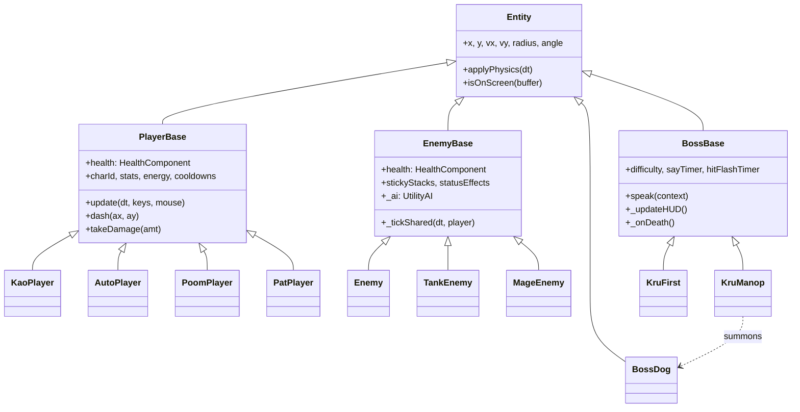

# MTC Game - Project Overview

สำหรับ AI Assistant — อ่านเมื่อเริ่มแชทใหม่เพื่อเข้าใจโปรเจคต์ก่อนลงมือ

**MTC the Game** — Top-down 2D Wave Survival Shooter, 15 waves + bosses + upgrades

**Stack:** Vanilla JS + HTML5 Canvas (ไม่มี framework) | **Target:** 60 FPS | **Status:** Beta v3.40.2

**Role:** You are an Expert HTML5 Canvas Game Developer (Lead Coder) working on the "MTC-Game" project.

Coding Standards & Architecture:

1. Tech Stack: Vanilla JavaScript (ES6+), HTML5 Canvas 2D, Web Audio API. No external frameworks.
2. Performance First (60FPS):
   - Avoid garbage collection (GC) churn in the game loop.
   - Use the Object Pool pattern for particles, projectiles, and floating texts.
   - Use O(1) swap-and-pop for array removals instead of `splice()`.
   - Implement Viewport Culling for `draw()` methods — cull before any sub-method runs.
   - draw() path: ห้าม template literal / string concat dynamic value → ใช้ ctx.globalAlpha + solid hex string
   - SpatialGrid (js/weapons/SpatialGrid.js): integer key only — ห้าม template literal key ใน build()/query()
3. Separation of Concerns: Strictly separate logic (`update(dt)`) from rendering (`draw(ctx)`). Never put `Math.random()` or state changes inside `draw()`.
4. Defensive Programming: Always use guard clauses for globals (e.g., `if (typeof CTX === 'undefined') return;`) and check variable existence before access.
5. Modular Structure (v3.39+): Core systems are split into specialized modules within directories (e.g., `js/ui/`, `js/weapons/`). Always check the directory for the specific class definition.

Output Preferences:

1. Zero Yapping: Be concise. Skip pleasantries and long explanations. Go straight to the analysis and the code.
2. Exact Edits Only: Provide exact code blocks, Unified Diffs, or clear search/replace snippets. Do NOT output the entire file unless explicitly requested. Save tokens.
3. Think Before Code: Always verify class inheritance (e.g., `Entity` -> `PlayerBase` -> `SpecificPlayer`) and variable scopes before overriding methods.

---

## Stability Legend

- 🟢 **STABLE** — แทบไม่เปลี่ยน (architecture, patterns, file locations)
- 🟡 **SEMI-DYNAMIC** — เปลี่ยนบางครั้ง (system integration, task checklists)
- 🔴 **DYNAMIC** — เปลี่ยนบ่อย (config values, code snippets, balance) → verify ใน codebase ก่อนใช้เสมอ

---

## 🗂️ File Structure 🟢

### Root

| ไฟล์            | หน้าที่                                                  |
| --------------- | -------------------------------------------------------- |
| `index.html`    | หน้าหลัก, โหลด JS ทั้งหมด                                |
| `sw.js`         | Service Worker — **bump version ทุกครั้งที่เปลี่ยนโค้ด** |
| `Debug.html`    | Debug/profiling page                                     |
| `manifest.json` | PWA manifest                                             |
| `secrets.js`    | CONFIG_SECRETS (GEMINI_API_KEY) — ไม่มี cheat codes      |

### `/Markdown Source/` — Documentation & Guides 🟢

| ไฟล์                              | หน้าที่                                           |
| --------------------------------- | ------------------------------------------------- |
| `Information/PROJECT_OVERVIEW.md` | ภาพรวมโปรเจกต์ (ไฟล์นี้)                          |
| `CHANGELOG.md`                    | บันทึกการเปลี่ยนแปลง                              |
| `Command/commit-push.md`          | Instruction สำหรับ commit และ push การเปลี่ยนแปลง |

### `/Markdown Source/Successed-Plan/` — Completed Milestone Documents 🟢

| ไฟล์                                | หน้าที่                                       |
| ----------------------------------- | --------------------------------------------- |
| `walkthrough.md`                    | คู่มือการเล่นและระบบเกม                       |
| `PERF_PLAN.md`                      | แผนและสถานะการทำ Performance Audit (Tier 1-4) |
| `RENDERING_REMASTER_PLAN.md`        | แผนการรีแฟคเตอร์ระบบเรนเดอร์ (v3.40.0)        |
| `REGRESSION_CHECKLIST.md`           | รายการตรวจสอบเพื่อป้องกันบั๊กถดถอย            |
| `MAP_REFACTOR_PLAN.md`              | แผนการรีแฟคเตอร์ระบบแผนที่                    |
| `MTC_BACKLOG.md`                    | รายการงานที่เสร็จสิ้นแล้ว                     |
| `COMPREHENSIVE_DEVELOPMENT_PLAN.md` | แผนการพัฒนาฉบับสมบูรณ์ (Archive)              |
| `REFACTOR_PLAN.md`                  | แผนการรีแฟคเตอร์ระบบดั้งเดิม                  |
| `claude_master_prompt.md`           | Master Prompt สำหรับ AI Assistant (Archive)   |
| `manop_phase2_storyboard.html`      | Storyboard สำหรับ Kru Manop Phase 2           |

### `/js/` — Core Logic

| ไฟล์          | หน้าที่สำคัญ                                                                                                                      |
| ------------- | --------------------------------------------------------------------------------------------------------------------------------- |
| `game.js`     | Game loop หลัก, state transitions, startGame()                                                                                    |
| `utils.js`    | Utility functions                                                                                                                 |
| `tutorial.js` | Tutorial system                                                                                                                   |
| `audio.js`    | SFX + BGM, Web Audio API, BGM crossfade system, namespace protection                                                              |
| `input.js`    | Keyboard/mouse/touch — global `keys` object, **mobile haptic feedback**, **button press states**, **touchcancel cleanup**         |
| `map.js`      | แผนที่, collision detection, MTCRoom, interactive objects (HackTerminal / MedStation / AmmoCrate / PowerNode), zone pattern cache |
| `menu.js`     | Main menu, `selectCharacter()`                                                                                                    |

### `/js/config/` — Configuration 🟢

| ไฟล์               | หน้าที่                                                        |
| ------------------ | -------------------------------------------------------------- |
| `BalanceConfig.js` | ค่าพลังตัวละคร, shop items, achievements, wave schedules       |
| `SystemConfig.js`  | Engine settings, audio volumes, map visual configs, API keys   |
| `GameTexts.js`     | UI strings, skill names, tutorial copy, admin console messages |

### `/js/effects/` — FX Engine 🟢

| ไฟล์                | หน้าที่                                     |
| ------------------- | ------------------------------------------- |
| `ParticleSystem.js` | Core FX engine (object pool)                |
| `WeatherSystem.js`  | Rain/Snow systems                           |
| `CombatEffects.js`  | FloatingText, impact sparks, hit flashes    |
| `VisualPolish.js`   | Glitch FX, screen shake, wave announcements |
| `OrbitalEffects.js` | OrbitalParticle system                      |
| `PatEffects.js`     | Pat-specific effects (Zanzo, Katana arc)    |

### `/js/weapons/` — Combat Systems 🟢

| ไฟล์                   | หน้าที่                                                |
| ---------------------- | ------------------------------------------------------ |
| `Projectile.js`        | คลาส `Projectile` และ Logic การเคลื่อนที่/ชน           |
| `WeaponSystem.js`      | คลาส `WeaponSystem` (การจัดการอาวุธของ Kao)            |
| `ProjectileManager.js` | คลาส `ProjectileManager`                               |
| `SpatialGrid.js`       | คลาส `SpatialGrid` สำหรับ Optimization การตรวจจับการชน |
| `PoomWeapon.js`        | Poom-specific weapon rendering logic                   |

### `/js/ui/` — User Interface 🟢

| ไฟล์                   | หน้าที่                                                     |
| ---------------------- | ----------------------------------------------------------- |
| `AchievementSystem.js` | คลาส `AchievementSystem` และ gallery                        |
| `ShopManager.js`       | คลาส `ShopManager` (DOM interaction)                        |
| `UIManager.js`         | HUD management, Boss HP, voice bubbles, character portraits |
| `CanvasHUD.js`         | การวาด UI บน Canvas (Minimap, Combo, Ammo)                  |

**Font System (index.html `<head>`)** 🟢 — 4 families, single Google Fonts request:

| CSS Variable     | Font                 | ใช้ที่                                  |
| ---------------- | -------------------- | --------------------------------------- |
| `--font-display` | Orbitron 700/900     | Zone labels, Wave title, Score, MTCRoom |
| `--font-hud`     | Rajdhani 500/600/700 | Skill names, cooldown timer, HUD body   |
| `--font-mono`    | Share Tech Mono      | Canvas numbers, timers, terminal text   |
| `--font-body`    | Kanit 400/600        | Body text, Thai language                |

> ⚠️ `postCanvas` (`<canvas id="postCanvas">`) exists in `index.html` as a placeholder for future post-processing (bloom/vignette) — **no JS implementation exists yet**. Do not reference `PostProcessor.js`; it does not exist.

### `/js/ai/` — AI Enhancement System 🟡

Load order: `UtilityAI.js → EnemyActions.js → PlayerPatternAnalyzer.js → SquadAI.js`

| ไฟล์                       | หน้าที่                                                                                                                                                         |
| -------------------------- | --------------------------------------------------------------------------------------------------------------------------------------------------------------- |
| `UtilityAI.js`             | Core decision system — 2Hz timer, utility scoring, personality-weighted, delegates actions ไป EnemyActions, อ่าน `_squadRole` override                          |
| `EnemyActions.js`          | Static action library — `retreat()`, `flank()`, `shieldWall()`, `strafeOrbit()` (stateless, ไม่มี state ของตัวเอง)                                              |
| `PlayerPatternAnalyzer.js` | `window.playerAnalyzer` singleton — Float32Array(30) ring buffer, detect: kiting/circling/standing/mixed, `dominantPattern()`, `dominantDirection()`, `reset()` |
| `SquadAI.js`               | `window.squadAI` singleton — 1Hz coordinator, `_BucketGrid` O(N), `tagOnSpawn()` static, role assignment: assault/flanker/shield/support                        |

> ⚠️ `EnemyPersonality.js`, `FormationController.js`, `BossAI.js` **ไม่มี** — ถูก revised ออก: Personality อยู่ใน `BALANCE.ai.personalities` (config.js), Formation รวมใน SquadAI, Boss AI อยู่ใน ManopBoss/FirstBoss โดยตรง

### `/js/systems/`

| ไฟล์             | หน้าที่                                                                                            |
| ---------------- | -------------------------------------------------------------------------------------------------- |
| `GameState.js`   | State management (single source of truth) + `window.gameState` compat                              |
| `WaveManager.js` | Wave progression, enemy spawning, deterministic schedule                                           |
| `TimeManager.js` | Bullet time                                                                                        |
| `ShopSystem.js`  | ร้านค้า, upgrades                                                                                  |
| `AdminSystem.js` | Debug console (GUEST/OPERATOR/ROOT) — `spawn manop [1\|2\|3]`, `spawn first [advanced]`, `devbuff` |

### `/js/entities/`

| ไฟล์         | หน้าที่                                                                                                                        |
| ------------ | ------------------------------------------------------------------------------------------------------------------------------ |
| `base.js`    | Base Entity class — ทุก entity สืบทอด                                                                                          |
| `enemy.js`   | **EnemyBase** (บรรทัด 87) + Enemy, TankEnemy, MageEnemy — ศัตรูใหม่ทุกตัว extends EnemyBase ได้ AI+StatusEffect+hitFlash ทันที |
| `summons.js` | Pets, helpers, power-up entities                                                                                               |

### `/js/entities/boss/`

| ไฟล์                     | หน้าที่                                                                                                                                                                                         |
| ------------------------ | ----------------------------------------------------------------------------------------------------------------------------------------------------------------------------------------------- |
| `BossBase.js`            | Base Boss class — shared lifecycle, death hooks                                                                                                                                                 |
| `ManopBoss.js`           | KruManop + BossDog classes (math boss encounters)                                                                                                                                               |
| `FirstBoss.js`           | KruFirst class (physics boss with GravitationalSingularity) — HP scaling is config-driven via `BALANCE.boss.first`.                                                                             |
| `boss_attacks_shared.js` | Shared attack effects — `ExpandingRing` (used by both bosses)                                                                                                                                   |
| `BarkWave.js`            | KruManop: Sonic cone bark attack (Phase 2)                                                                                                                                                      |
| `GoldfishMinion.js`      | KruManop: Kamikaze sine-wave fish (Phase 3)                                                                                                                                                     |
| `BubbleProjectile.js`    | KruManop: Slowing bubbles (Phase 3)                                                                                                                                                             |
| `MatrixGridAttack.js`    | KruManop: Grid-based area denial                                                                                                                                                                |
| `DomainExpansion.js`     | KruManop: Ultimate "Metrics-Manipulation" singleton                                                                                                                                             |
| `EquationSlam.js`        | KruManop: Shockwave ring with formula shards                                                                                                                                                    |
| `DeadlyGraph.js`         | KruManop: Expanding laser beam with risk/reward zone                                                                                                                                            |
| `ChalkWall.js`           | KruManop: Ground hazard chalk lines                                                                                                                                                             |
| `boss_attacks_first.js`  | KruFirst attacks — `FreeFallWarningRing`, `PorkSandwich`, `EmpPulse`, `PhysicsFormulaZone`, `ParabolicVolley`, `OrbitalDebris`, `GravitationalSingularity`, `GravityWell`, `SuperpositionClone` |

### `/js/entities/player/`

| ไฟล์            | ตัวละคร     | บทบาท                                                                                                                                                                                                    |
| --------------- | ----------- | -------------------------------------------------------------------------------------------------------------------------------------------------------------------------------------------------------- |
| `PlayerBase.js` | Base ทุกตัว | `applyDevBuff()` — Dev Mode stat-package buff, `_hitFlashTimer`, passive unlock. charId-branching allowed here (no instanceof).                                                                          |
| `Kaoplayer.js`  | เก้า        | Assassin — stealth, teleport, clone                                                                                                                                                                      |
| `PoomPlayer.js` | ภูมิ        | Spiritual Warrior — ritual, naga, garuda                                                                                                                                                                 |
| `AutoPlayer.js` | ออโต้       | Thermodynamic Brawler — Heat Wave, Vacuum Pull+Ignite (Q), Overheat Detonation (E), Wanchai Stand (R-Click), Heat Tier System (COLD/WARM/HOT/OVERHEAT), Stand Meter, ORA Combo, Skill Synergy, Rage Mode |
| `PatPlayer.js`  | แพท         | Samurai Ronin — Katana dual-mode (Slash Wave / Melee Combo), Zanzo Flash Q (afterimage blink+ambush), Iaido Strike R (cinematic kill), Blade Guard R-Click (reflect projectiles)                         |

### `/js/rendering/`

- `PlayerRenderer.js` — Dispatcher (`static draw()`) + shared helpers: `_drawBase()` (generic fallback), `_getLimbParams()`, `_drawGroundShadow()`, `_drawGroundFeet()`, `_drawHitFlash()`, `_drawLevelBadge()`, `_drawLowHpGlow()`, `_drawEnergyShield()`
- `KaoRenderer.js` — `_drawKao()` + `_drawKaoClone()`
- `AutoRenderer.js` — dispatcher `_drawAuto()` + 9 part functions (`_drawAutoDashTrail`, `_drawAutoGroundFX`, `_drawAutoVacuumRing`, `_drawAutoDetonationRing`, `_drawAutoStandGuard`, `_drawAutoStandRush`, `_drawAutoChargePunch`, `_drawAutoBody`, `_drawAutoWeaponFists`) + `_drawAutoAura()` + `_drawWanchaiStand()`. Static body cache: `_bodyCache` (Map, tier-keyed).
- `PoomRenderer.js` — `_drawPoom()`
- `PatRenderer.js` — `_drawPat()`
- `BossRenderer.js` — วาด boss ทั้งหมด (KruManop, KruFirst, BossDog, domain effects)
- `ProjectileRenderer.js` — วาด projectile ทั้งหมด (bullets, punches, FX)
- `RenderTokens.js` — Visual token system — single source of truth for palette, glow, stroke, alpha. All renderers read `RT.*`; never hardcode style values. `RT.override(patch)` for skin themes; `RT.reset()` to unload.

> ⚠️ **Dispatch pattern — graceful fallback:** `PlayerRenderer.draw()` เรียก `window.KaoRenderer?._drawKao()` ก่อนเสมอ; ถ้า file ยังไม่โหลด (เช่น index.html load order ผิด) จะ fallback กลับมาเรียก `PlayerRenderer._drawKao()` แทน — ป้องกัน crash ระหว่าง dev

### `/assets/audio/`

`menu.mp3`, `battle.mp3`, `boss.mp3`, `glitch.mp3`

---

## 📝 Version Increment Criteria 🟡

**Service Worker Location:** `sw.js` line 1: `const CACHE_NAME = 'mtc-cache-vX.X.X';`

### 🎯 Decision Flow

| **Question**                                            | **Answer** | **Version Increment** |
| ------------------------------------------------------- | ---------- | --------------------- |
| 1. Is this a breaking change?                           | Yes        | **+1.00.00** (Major)  |
| 2. Is this a major new system or architecture refactor? | Yes        | **+0.01.00** (Minor)  |
| 3. Is this a bug fix or minor improvement?              | Yes        | **+0.00.01** (Patch)  |

### 📋 Version Types

#### **Major Version (+1.00.00)**

- Breaking changes that affect save compatibility or core game mechanics
- Complete engine migration (e.g., Godot migration)
- Fundamental architecture overhaul
- **NOT currently used in development cycle**

#### **Minor Version (+0.01.00)**

- Major new systems (AI Enhancement System, BGM Crossfade System)
- Architecture refactors (EnemyBase consolidation, new inheritance patterns)
- Complete new gameplay systems (Domain Expansion, Boss AI overhaul)
- Multiple related features bundled together
- **4+ new files created**
- Significant gameplay enhancement

#### **Patch Version (+0.00.01)**

- Bug fixes (Cooldown HUD fixes, collision corrections)
- Balance tweaks (Stat adjustments, difficulty modifications)
- Minor features (Individual skill improvements, UI polish)
- Documentation updates (README, changelog, PROJECT_OVERVIEW)
- Small quality-of-life improvements

### ⚠️ Important Notes

- **Documentation-only updates** should increment patch version (+0.00.01) per workflow rules
- **Always update** all documentation files when incrementing version:
  - `sw.js` (CACHE_NAME)
  - `CHANGELOG.md` (add entry)
  - `PROJECT_OVERVIEW.md` (update status version)

### 🚦 Version Bump Ownership — Single Source of Truth

**IDE (ตอน commit) เท่านั้นที่ bump เลขเวอร์ชัน** — ไม่ว่าจะใช้ Windsurf, Cursor, Antigravity หรือ IDE ใดก็ตาม

| Role                         | Version Action              |
| ---------------------------- | --------------------------- |
| Claude (code analysis/fixes) | ❌ ไม่แตะเลขเวอร์ชัน        |
| Claude (doc summary in chat) | ❌ ไม่แตะเลขเวอร์ชัน        |
| IDE — commit & push          | ✅ bump ทุกไฟล์ในครั้งเดียว |

**เหตุผล:** ถ้า Claude อัพเดทเลขใน `PROJECT_OVERVIEW.md` แล้ว IDE bump อีกรอบ → เวอร์ชันใน `sw.js` / `CHANGELOG.md` / `PROJECT_OVERVIEW.md` จะ desync กัน

**Claude + multi-session workflow:** Claude อาจถูกตัด session กลางคัน (token หมด) และขึ้นแชทใหม่บ่อย — ห้าม Claude เขียน version จริงลงไฟล์ใดๆ ทั้งนั้น ให้ใช้ `[NEXT VERSION]` ใน chat summary เท่านั้น IDE จะเติมเลขจริงตอน commit

---

## 🎮 Architecture 🟢

#### Complete Class Hierarchy



#### Core Loop & Lifecycle

The game follows a strict frame lifecycle (60 FPS target):

1. **Input Handling** (`input.js`): Captures keyboard, mouse, and touch states.
2. **Logic Update** (`game.js` → `updateGame(dt)`):
   - **Physics & AI**: `applyPhysics`, `_tickShared`, `UtilityAI`, `SquadAI`.
   - **State Changes**: Health reduction, cooldown decay, status effects.
   - **Collision**: `SpatialGrid` query and resolution.
3. **Rendering Dispatch** (`game.js` → `drawGame()`):
   - **Background Fill**: Canvas filled via linear gradient (no `clearRect` — gradient covers full frame).
   - **Draw Order**: Map/Terrain → Environment (decals, casings) → Power-ups → Special Effects → Drone → Player → Enemies → Boss → HUD.
   - ⚠️ `PostProcessor.js` — **does NOT exist**. Post-processing is not yet implemented.

#### Key Design Patterns

- **Separation of Concerns**: Logic (`update(dt)`) is strictly isolated from rendering (`draw(ctx)`). `draw` methods are read-only and deterministic.
- **Object Pooling**: `ParticleSystem`, `FloatingTextSystem`, and `ProjectileManager` reuse objects to eliminate Garbage Collection (GC) stutter.
- **Spatial Grid**: `SpatialGrid.js` provides O(1) cell-based collision lookups, essential for high entity counts.
- **Bitmap Caching**: `OffscreenCanvas` caches static body parts (e.g., `AutoRenderer._bodyCache`) to reduce per-frame path construction overhead.
- **Singleton State**: `GameState.js` is the single source of truth for game phase, time scale, and global flags.
- **Visual Tokens**: `RenderTokens.js` centralizes all colors, glows, and stroke weights.

#### Hidden Cross-File Dependencies

- **GameState Singleton**: Centralized state manager consumed by almost every core system.
- **Special Effects System**: `window.specialEffects` array used for complex, multi-frame visual/logic objects (e.g., `DomainExpansion`, `DeadlyGraph`).
- **Audio Namespace**: Global `Audio` instance with protected namespaces to prevent overlapping BGM/SFX.
- **WorkerBridge**: Main-thread bridge to `analyzer-worker.js` for off-thread AI pattern analysis.
- **UIManager / CanvasHUD**: UIManager handles DOM-based HUD, while CanvasHUD handles direct-to-canvas rendering (Minimap, arcs).
- **`window.hackTerminalActive`**: Written by `HackTerminal` (map.js) when player activates it; READ by `WaveManager.updateWaveEvent()` trickle block — cross-file flag with no direct import.
- **`game.js _checkProximityInteractions()`**: Owns all player-E interactions with interactive objects (HackTerminal, MedStation, AmmoCrate, PowerNode). Logic does NOT live in map.js.
- **`game.js _tickEnvironment()`**: Owns per-frame cooldown ticks and PowerNode aura for interactive objects. MapSystem.update() only resolves entity collisions with static objects.

### Core Loop

```
Input (input.js) → Game Update (game.js) → Entity Updates → Collision (map.js) → Render → UI (ui.js)
```

### Key Design Patterns

- **Object Pooling** — particles/projectiles/FloatingText (effects.js) ลด GC
- **State Management** — GameState singleton
- **Static Bitmap Caching** — ใช้ `OffscreenCanvas` ใน `BossRenderer` (`_getOrCreateBodyBitmap`), `PlayerRenderer`, และ `AutoRenderer` (`_bodyCache` Map keyed by heatTier) เพื่อ cache static body parts
- **Rendering Decoupling** — `PlayerRenderer.draw()` dispatcher → `_drawKao()` / `_drawPoom()` / `_drawAuto()`, `BossRenderer.draw()` dispatcher → `drawBoss()` / `drawBossFirst()` / `drawBossDog()`
- **Spatial Grid** — weapons.js collision: O(E) build, O(P×k) query — เร็วกว่า O(P×E) brute force \~12×
- **Module-level JSDoc Headers** — ทุกไฟล์ JS มี header บอกสารบัญ (TOC) พร้อมเลขบรรทัด ช่วยให้ AI Assistant นำทาง codebase ได้เร็วขึ้นโดยไม่ต้องอ่านไฟล์ทั้งหมด
- **No** **`instanceof`** **in PlayerBase** — ใช้ behavior flags แทน (`passiveSpeedBonus`, `usesOwnLifesteal`)
- **Deterministic Rendering** — ห้าม `Math.random()` ใน draw loop เด็ดขาด

### Integration Points

- Menu→Game: `selectCharacter()` → `window.selectedChar` → `startGame()`
- Input→Player: `keys.w/a/s/d/space/q/e/r/b/t/f/shift` object
- Wave→Enemy: `WaveManager.spawn()` → `window.enemies[]`
- Achievement: `AchievementSystem.unlock()` → UIManager popup
- Audio: Global `Audio` instance + namespace protection

---

## 🔧 Development Workflow 🟢

### AI File Versioning Rule (สำคัญมาก)

**ทุก task ใหม่ในแชทใหม่ — รอรับไฟล์จากผู้ใช้เสมอ ห้ามใช้ output เก่าในแชท**

เหตุผล: ผู้ใช้อาจแก้ไขใน project จริงหลัง copy output ไปแล้ว ทำให้ output เก่าล้าสมัย

```
แชทใหม่ / task แรก + ผู้ใช้แนบไฟล์มาด้วย:
  ใช้ uploads ที่แนบมาได้เลย — ไม่ต้องถามหาไฟล์อีก

แชทใหม่ / task แรก + ผู้ใช้ไม่ได้แนบไฟล์:
  แจ้ง "กรุณาส่งไฟล์ล่าสุดจาก project มาด้วยครับ"
  (ขอเฉพาะไฟล์ที่จำเป็นต่อ task นั้น)

task ต่อเนื่องในแชทเดิม (ผู้ใช้ไม่ได้แนบไฟล์ใหม่):
  ตรวจ /mnt/user-data/outputs/<filename> ก่อนเสมอ
  ถ้ามี → ใช้ output (cp /mnt/user-data/outputs/X /home/claude/X)
  ถ้าไม่มี → ใช้ /mnt/user-data/uploads/<filename>
  ❌ ห้ามถามหาไฟล์ซ้ำถ้ามีอยู่แล้วใน uploads หรือ outputs

task ต่อเนื่อง + ผู้ใช้อัปโหลดไฟล์ใหม่:
  ใช้ uploads (อาจมีการแก้ไขนอก session) — output เก่าถือเป็น stale
```

**⚠️ ขั้นตอน mandatory ก่อนแก้ไฟล์ใดๆ ในแชทเดิม:**

```bash
# 1. ตรวจว่ามี output ล่าสุดไหม
ls /mnt/user-data/outputs/<filename>

# 2. ถ้ามี → cp จาก outputs ไม่ใช่ uploads
cp /mnt/user-data/outputs/config.js /home/claude/config.js   ✅
cp /mnt/user-data/uploads/config.js /home/claude/config.js   ❌ (ถ้ามี output อยู่แล้ว)
```

**🚫 ห้ามถามหาไฟล์ซ้ำใน scenario เหล่านี้:**

- ผู้ใช้เพิ่งแนบไฟล์มาใน message ก่อนหน้าในแชทเดียวกัน
- มีไฟล์อยู่ใน /mnt/user-data/uploads/ หรือ /mnt/user-data/outputs/ แล้ว
- task ต่อเนื่องจาก task ก่อนหน้าในแชทเดียวกัน (เช่น "แก้ตามลำดับ" หลังจากวิเคราะห์)

### Commit & Push Workflow

1. Bump `sw.js` cache version (เช่น v3.11.14 → v3.11.15)
2. เพิ่ม entry ใน `CHANGELOG.md`
3. Commit & push พร้อมคำอธิบายละเอียด

**คำสั่ง IDE (ใช้ได้กับทุก IDE — Windsurf / Cursor / Antigravity / อื่นๆ):**
_"commit and push, check changes first, write detailed description, update @sw\.js, @CHANGELOG.md, @PROJECT_OVERVIEW\.md"_

> Claude มีหน้าที่เขียนโค้ด 100% — IDE รับผิดชอบ commit & push

---

## ⚙️ Critical Technical Notes

### Hit Flash System 🔴

**Properties ใน PlayerBase:** `_hitFlashTimer` (1→0), `_hitFlashBig` (bool), `_hitFlashLocked` (bool)

- Decay: `dt * 6` (\~167ms ที่ 60fps)
- `takeDamage()` set `_hitFlashLocked = true` พร้อม timer — ปลด lock เมื่อ timer < 0.4
- **ทำไมต้อง lock:** contact damage เรียก `takeDamage()` ทุกเฟรม → timer reset ซ้ำ → flash ค้างแดงตลอด

### Passive Unlock Architecture 🟢

- `PlayerBase.checkPassiveUnlock()` ตรวจ stealth count — เหมาะแค่ Kao
- **Poom + Auto ต้อง override** **`checkPassiveUnlock()`** มิฉะนั้น passive unlock ไม่ได้เลย
- `passiveUnlockStealthCount: 0` สำหรับ Auto/Poom (ห้ามใช้ 99)
- Behavior flags แทน instanceof:
  - `this.passiveSpeedBonus = N` — speed multiplier หลัง unlock
  - `this.usesOwnLifesteal = bool` — true = subclass จัดการ lifesteal เอง
- Dev Mode **ไม่** unlock passive — ใช้ `applyDevBuff()` (flag `_devBuffApplied` ป้องกันซ้ำ)

### Wave Events 🟡

| Event  | Effect                                |
| ------ | ------------------------------------- |
| Dark   | Darkens the arena                     |
| Fog    | Spawns fog overlay                    |
| Speed  | Increases enemy movement speed        |
| Glitch | Inverts controls, reduces melee dmg   |
| Boss   | Spawns a deterministic boss encounter |

### MTC Room

- ห้องฟื้นฟู — bounds, features, boss safe spawn Y อยู่ใน `BALANCE.mtcRoom` และ `BossBase` constructor guard
- **Citadel Approach Corridor** — x∈[-200,200], y∈[-500,-340] ต้องไม่มีสิ่งกีดขวาง (trees/vending) เพื่อไม่ให้ติดกำแพง

---

## 🔍 Quick Reference — Common Tasks 🟡

### เพิ่มตัวละครใหม่

**ต้องแก้:** `PlayerBase.js` (สืบทอด), `config.js`, `PlayerRenderer.js` (เพิ่ม `_draw[Name]()` + dispatcher), `menu.js`, `ui.js`, `audio.js`, `css/main.css`
**อาจกระทบ:** `game.js`, `WaveManager.js`, `weapons.js`

### เพิ่มบอสใหม่

**ต้องแก้:** สร้าง `js/entities/boss/[Name]Boss.js` (extends BossBase), `js/entities/boss/boss_attacks_[name].js` (หรือเพิ่มใน shared ถ้า attack ใช้ได้กับทุก boss), `BossRenderer.js` (เพิ่ม static draw method + dispatcher), `config.js`, `WaveManager.js`, `audio.js`, `index.html` (script tag)
**อาจกระทบ:** `summons.js`, `map.js`
⚠️ Boss speech: `speak()` (BossBase) reads `GAME_TEXTS.ai.bossTaunts[]` → `UIManager.showBossSpeech()` (typewriter DOM chip) — **ไม่ใช่ Gemini**, ไม่ async, ไม่ต้อง try-catch | Boss queue: waves 3,6,9,12,15
⚠️ window exports ต้องมี backward-compat alias (เช่น `window.BossXxx = XxxClass`) สำหรับ WaveManager + AdminSystem
⚠️ **Config-driven scaling invariant** — boss constructor ต้องอ่านค่า scaling จาก `BALANCE.boss.[name]` ห้าม hardcode multipliers ในโค้ด:

```js
const _B = BALANCE.boss.myBoss; // ✅ config-driven
this.maxHp = BALANCE.boss.baseHp * difficulty * (_B.hpBaseMult ?? 1.0);
// ❌ this.maxHp = BALANCE.boss.baseHp * difficulty * 0.85;  // hardcode — config ignored
```

ใช้ `?? fallback` เสมอ — ป้องกัน crash ถ้า config key ยังไม่ได้ใส่

### เพิ่มศัตรูใหม่

**ต้องแก้:** `enemy.js` (extends EnemyBase — ได้ AI+StatusEffect ทันที), `config.js`, `WaveManager.js` (SquadAI.tagOnSpawn() จะ auto-tag หลัง enemies.push()), `audio.js`, `effects.js`
**อาจกระทบ:** `weapons.js`

### เพิ่มอาวุธใหม่

**ต้องแก้:** `weapons.js`, `config.js`, `[Character].js`, `audio.js`, `effects.js`
⚠️ อาวุธ Kao ใหม่ → ต้องเพิ่ม muzzle offset ใน `shootSingle()` ด้วย

### เพิ่มสกิล (Active)

**ต้องแก้:** `[Character].js`, `config.js`, `audio.js`, `effects.js`, `ui.js`
**อาจกระทบ:** `input.js` (key binding), `PlayerRenderer.js` (animation)

### แก้ Visual / Player Animation

**ต้องแก้:** `PlayerRenderer.js`, `effects.js`
⚠️ `moveT`/`bobY`/`R` ต้อง declare ก่อน dash ghost loop — ดู Critical Notes

### แก้ Weapon / Projectile System

**ต้องแก้:** `weapons.js`, `config.js`, `effects.js`, `audio.js`
⚠️ Poom ยิงผ่าน `PoomPlayer.shoot()` โดยตรง — ไม่ผ่าน WeaponSystem

### แก้ Audio

**ต้องแก้:** `audio.js`, `config.js`
⚠️ มี BGM namespace collision fix — ตรวจก่อนแก้ Audio constructor
⚠️ BGM crossfade system uses Web Audio API GainNode — check \_crossfadeOutAndStop() for transitions

### แก้ UI / HUD

**ต้องแก้:** `ui.js`, `effects.js`, `css/main.css`
⚠️ AchievementSystem อยู่ใน `ui.js` | data save ผ่าน `getSaveData()`/`setSaveData()`
⚠️ **Mobile UI Enhancement:** Use `.pressed` class for button states, `navigator.vibrate(12)` for haptic feedback, `-webkit-tap-highlight-color: transparent` for better mobile experience
⚠️ **Character portraits** = static SVG strings in `window.PORTRAITS[charId]` (ui.js) — injected into `<div id="char-avatar-{charId}">`. NOT canvas draw. See mtc-rendering §18 for SVG art conventions.

### แก้ Pause / Menu UI

**ต้องแก้:** `css/main.css` (`.resume-prompt-inner`, `.resume-btn`, `.rp-corner` ฯลฯ), `index.html` (HTML structure ของ `#resume-prompt`)
⚠️ Stat bar ของ char select อยู่ใน `index.html` (hard-coded width % + val) — ถ้าแก้ balance ต้องอัพเดท stat bars ด้วย

### แก้ Map / MTC Room

**ต้องแก้:** `map.js`, `config.js`
⚠️ Bounds: x:−150→150, y:−700→−460 | Boss spawn guard ใน BossBase constructor
⚠️ Interactive object interaction lives in `game.js _checkProximityInteractions()` — NOT inside map.js update()
⚠️ Interactive object update (cooldown, PowerNode aura) lives in `game.js _tickEnvironment()` — map.js ไม่มี per-frame update ของตัวเอง
⚠️ Wave reset hook for usedThisWave flag: loop `mapSystem.objects` in game.js wave-clear trigger

### เพิ่ม Achievement

**ต้องแก้:** `ui.js` (AchievementSystem + ACHIEVEMENT_DEFS), `config.js`, `audio.js`, `css/main.css`

### เพิ่ม Wave Event

**ต้องแก้:** `WaveManager.js`, `config.js`, `effects.js`, `audio.js`, `ui.js`

### เพิ่ม Shop Item

**ต้องแก้:** `ShopSystem.js`, `config.js`, `ui.js`
⚠️ Shop location: `{x:−350, y:350, INTERACTION_RADIUS:90}` — proximity interaction

### แก้ Game State / Progression

**ต้องแก้:** `GameState.js`, `game.js`, `WaveManager.js`, `ShopSystem.js`

### เพิ่ม Special Effect / Particle

**ต้องแก้:** `effects.js`, `config.js`
⚠️ ใช้ object pool เสมอ — ห้าม `new` ใน draw/update loop

---

## 🎨 Visual Workflow — แก้ Visual ต้องใช้ไฟล์ไหน?

### แกนหลัก 3 ไฟล์ (รู้จักก่อน)

| ไฟล์                | หน้าที่ visual                                                 | ตัวอย่าง                                 |
| ------------------- | -------------------------------------------------------------- | ---------------------------------------- |
| `[Name]Renderer.js` | **shape / animation / look** ของ entity นั้นโดยตรง             | body, glove, mongkhon, flame crown       |
| `effects.js`        | **ผลกระทบชั่วคราว** ที่เกิดจาก event (spawn ครั้งเดียวแล้วหาย) | กระจาย particle, ตัวเลขลอย, screen shake |
| `config.js`         | **ค่าตัวเลข / สี** ที่ Renderer และ effects.js ดึงไปใช้        | สีผนัง, ระยะแสง, ค่า LIGHTING            |

---

### ✏️ แก้โมเดลตัวละคร (shape / animation)

**ใช้แค่** **`PlayerRenderer.js`** — ไม่ต้องแตะไฟล์อื่น

```
ต้องการ                         → แก้ที่ไหน
───────────────────────────────────────────────────────
เปลี่ยน body shape               PlayerRenderer.js → _drawKao / _drawPoom / _drawAuto
เพิ่ม accessory (เช่น mongkhon)  PlayerRenderer.js → layer ที่เหมาะ
แก้ bob / sway animation         PlayerRenderer.js → oscillator vars (bob, breathe)
เปลี่ยนสี arm / glove             PlayerRenderer.js → color literal หรือดึงจาก config
แก้ hit flash visual             PlayerRenderer.js → _hitFlashTimer block
```

**เมื่อไหรถึงต้องใช้** **`effects.js`** **ร่วม?**
เมื่อ visual นั้น _เกิดจาก event_ และ _หายเองหลังเวลาหนึ่ง_:

- เพิ่ม particle burst เมื่อ skill ถูกกด → `spawnParticles()` เรียกจาก player file, renderer แค่วาด body
- ตัวเลขลอย damage / heal → `spawnFloatingText()`
- เพิ่ม OrbitalParticle วนรอบตัวละคร → `OrbitalParticleSystem` ใน effects.js
- screen shake เมื่อ crit → `addScreenShake()`

> **กฎง่ายๆ:** ถ้า visual นั้น _วาดซ้ำทุกเฟรมตลอดชีวิต entity_ → `Renderer.js`\
> ถ้า _spawn ครั้งเดียวแล้ว fade/หาย_ → `effects.js`

---

### ✏️ แก้โมเดลบอส

เหมือนตัวละครผู้เล่นทุกอย่าง แต่เปลี่ยนไฟล์เป็น **`BossRenderer.js`**:

```
แก้ shape / animation / layer    → BossRenderer.js  (static draw methods)
เพิ่ม particle burst / text      → spawnParticles() / spawnFloatingText() ใน boss files
แก้ domain expansion visual      → BossRenderer.js + boss_attacks_manop.js (DomainExpansion class)
```

---

### ✏️ แก้ Visual แผนที่ (Map)

แผนที่แบ่งชัดเป็น 3 layer:

```
Layer                  แก้ที่ไหน                    ตัวอย่าง
──────────────────────────────────────────────────────────────────────
Object shape/color     map.js                        drawWall(), drawDesk(), drawServer()
Object color palette   config.js                     BALANCE.map.mapColors.*
Object layout/size     map.js (generateCampusMap)    เพิ่ม/ย้าย object, เปลี่ยน grid
Lighting radius/color  config.js                     BALANCE.LIGHTING.*
Lighting logic         map.js (drawLighting)         punchLight(), tint type
Floor base color       config.js                     BALANCE.map.mapColors.floor / floorAlt
Weather (rain/snow)    effects.js                    WeatherSystem class
Screen shake           effects.js                    addScreenShake()
Decals (blood spots)   effects.js                    DecalSystem
Shell casings          effects.js                    ShellCasingSystem
```

**workflow ปกติเมื่อแก้ map visual:**

1. เปลี่ยนสีผนัง/พื้น → `config.js` → `BALANCE.map.mapColors`
2. เปลี่ยน shape ของ object → `map.js` → `drawWall()` / `drawDesk()` ฯลฯ
3. เพิ่ม object ใหม่ → `map.js` → เพิ่ม type ใน `MapObject.draw()` switch + `generateCampusMap()`
4. แก้ระยะแสง/สีแสง → `config.js` → `BALANCE.LIGHTING`
5. เพิ่ม particle/decal เมื่อ object ถูกทำลาย → `effects.js` → `DecalSystem` / `spawnParticles()`

**Interactive Map Objects** (added v3.39+):

| Class          | Type string      | Location | mechanic                                                        |
| -------------- | ---------------- | -------- | --------------------------------------------------------------- |
| `HackTerminal` | `'hackterminal'` | map.js   | กด E → pause trickle spawn (window.hackTerminalActive flag)     |
| `MedStation`   | `'medstation'`   | map.js   | กด E → regen HP, usedThisWave flag resets per wave              |
| `AmmoCrate`    | `'ammocrate'`    | map.js   | กด E → restore energy, usedThisWave flag                        |
| `PowerNode`    | `'powernode'`    | map.js   | passive aura — player.damageBoost ×(1+mult) on enter, ÷ on exit |

⚠️ Interactive objects extend `MapObject` — inherits AABB collision and draw() dispatch automatically
⚠️ PowerNode uses multiplication/division on `damageBoost` (never additive) to compose correctly with shop buffs
⚠️ `window.hackTerminalActive` flag read by `WaveManager.updateWaveEvent()` trickle block

**Zone Pattern Cache** (`_initPatternCanvases`):

- Called once per canvas context from `drawZoneFloors()` — zero GC after first frame
- Builds offscreen tile canvases and calls `ctx.createPattern()` per zone key
- Patterns are world-locked: phase offset derived from `worldToScreen(0,0)` mod tile dimensions so patterns stay fixed as camera pans

> ⚠️ `map.js` ใช้ `CTX` (global canvas context) โดยตรง — ต่างจาก Renderer files ที่รับ `ctx` เป็น parameter\
> ⚠️ ห้าม `Math.random()` ใน `draw()` ของ map object — ใช้ deterministic seed แทน (ดูตัวอย่างใน `drawWall()`)

---

### 📊 Decision Tree สรุป

```
ต้องการแก้ visual อะไร?
│
├─ shape / body / animation ของ entity (วาดทุกเฟรม)
│   ├─ ตัวละคร   → PlayerRenderer.js
│   └─ บอส       → BossRenderer.js
│
├─ เกิดจาก event แล้วหายไปเอง
│   ├─ กระจาย particle     → effects.js  (spawnParticles)
│   ├─ ตัวเลขลอย           → effects.js  (spawnFloatingText)
│   ├─ orbital ring        → effects.js  (OrbitalParticleSystem)
│   ├─ screen shake        → effects.js  (addScreenShake)
│   ├─ decal / blood spot  → effects.js  (DecalSystem)
│   └─ shell casing        → effects.js  (ShellCasingSystem)
│
├─ ค่าตัวเลข / สีที่ใช้ใน Renderer หรือ effects
│   └─ config.js  (BALANCE.map.mapColors, BALANCE.LIGHTING, BALANCE.characters)
│
└─ แผนที่
    ├─ shape ของ object    → map.js  (draw methods ใน MapObject)
    ├─ layout / ตำแหน่ง   → map.js  (generateCampusMap)
    ├─ สี palette          → config.js  (BALANCE.map.mapColors)
    └─ แสง/เงา            → config.js  (BALANCE.LIGHTING) + map.js  (drawLighting)
```

---

## � Debugging Tools & Files

### Primary Debugging Files

| ไฟล์                        | หน้าที่                                                                        | วิธีใช้                                                              |
| --------------------------- | ------------------------------------------------------------------------------ | -------------------------------------------------------------------- |
| `Debug.html`                | **หน้า debug หลัก** - system diagnostics, performance profiling, health checks | เปิดใน browser โดยตรง (ไม่ต้องผ่านเกม)                               |
| `js/systems/AdminSystem.js` | **Admin Console** - commands, god mode, entity spawning                        | กด `~` ในเกม → พิมพ์คำสั่ง (`help`, `spawn manop`, `god`, `devbuff`) |
| `js/VersionManager.js`      | **Version sync** - ดึง version จาก service worker                              | Auto-run ตอน start เกม                                               |
| `sw.js`                     | **Service Worker** - cache management, version control                         | Update `CACHE_NAME` ทุกครั้งที่แก้โค้ด                               |

### Debug.html Features

- **System Health Checks** - ตรวจสอบ files loading, API availability, memory usage
- **Performance Profiling** - FPS monitoring, object pooling efficiency, GC pressure
- **Live Console** - Real-time log output พร้อม color coding
- **Achievement Inspector** - Browse achievements, unlock states, requirements
- **BALANCE Inspector** - View all config values, character stats, weapon data
- **Export Tools** - Copy diagnostics, save logs, generate reports

### Admin Console Commands (ในเกม)

กด `~` เปิด console แล้วพิมพ์:

| คำสั่ง                   | ผล                                | Permission |
| :----------------------- | :-------------------------------- | :--------- |
| `help`                   | แสดงคำสั่งทั้งหมด                 | GUEST      |
| `heal [100]`             | ฟื้น HP                           | OPERATOR   |
| `score [5000]`           | เพิ่มคะแนน                        | OPERATOR   |
| `next wave`              | ข้าม wave ปัจจุบัน                | OPERATOR   |
| `set wave [10]`          | กระโดดไป wave 10                  | OPERATOR   |
| `give weapon [rifle]`    | ได้รับอาวุธ                       | OPERATOR   |
| `spawn manop [1\|2\|3]`  | เรียก Kru Manop (phase 1-3)       | OPERATOR   |
| `spawn first [advanced]` | เรียก Kru First (normal/advanced) | OPERATOR   |
| `devbuff`                | +50% HP/EN, +25% DMG, +20% SPD    | OPERATOR   |
| `energy [100]`           | ฟื้นพลังงาน                       | OPERATOR   |
| `god` / `god off`        | ลิงก์เกอร์ / ปิด                  | ROOT       |
| `kill all`               | ฆ่าศัตรูทั้งหมด                   | ROOT       |
| `speed [2.0]`            | เพิ่มความเร็ว ×2                  | ROOT       |
| `reset buffs`            | ล้าง buff ทั้งหมด                 | ROOT       |
| `fps`                    | เปิด/ปิด FPS overlay              | GUEST      |

### Debugging Workflow

1. **Start with Debug.html** - ตรวจสอบ system health ก่อน
2. **Use Admin Console** ในเกมสำหรับ real-time testing
3. **Check Browser Console** (F12) สำหรับ JavaScript errors
4. **Use Performance Tab** ใน DevTools สำหรับ profiling
5. **Network Tab** สำหรับ API calls และ resource loading

---

## �🐛 Common Debugging Solutions

| ปัญหา                                                                                                  | สาเหตุ                                                                                                                                                                | วิธีแก้                                                                                                                                                  |
| ------------------------------------------------------------------------------------------------------ | --------------------------------------------------------------------------------------------------------------------------------------------------------------------- | -------------------------------------------------------------------------------------------------------------------------------------------------------- |
| `ReferenceError: Cannot access X before initialization` ใน PlayerRenderer                              | `moveT`/`bobY`/`R` ถูกใช้ก่อน declare                                                                                                                                 | ย้าย var declarations ขึ้นบนสุดของ function ก่อน dash ghost loop                                                                                         |
| Hit flash ค้างแดงตลอด                                                                                  | Contact damage reset `_hitFlashTimer` ทุกเฟรม                                                                                                                         | ตรวจ `_hitFlashLocked` flag ใน PlayerBase.js                                                                                                             |
| กระสุนออกจากตัวผู้เล่นแทนปากกระบอกปืน                                                                  | `offset` ใน `shootSingle()` ผิด                                                                                                                                       | ดูตาราง Muzzle Offset ใน SKILL.md §8                                                                                                                     |
| Passive unlock ไม่ทำงาน (Poom/Auto)                                                                    | Base `checkPassiveUnlock()` ตรวจ stealth count                                                                                                                        | Override `checkPassiveUnlock()` ใน subclass                                                                                                              |
| "Malformed Edit" (IDE multi-line edit)                                                                 | Multi-line JS strings                                                                                                                                                 | บอก "ใช้ Python script" — script ใช้ UTF-8 + string.replace()                                                                                            |
| Boss spawn ใน MTC Room                                                                                 | spawnY ติด room bounds                                                                                                                                                | ตรวจ BossBase constructor guard — safe spawn Y อยู่ใน BALANCE.mtcRoom                                                                                    |
| Performance drop                                                                                       | GC / render bottleneck                                                                                                                                                | ตรวจ object pooling ใน effects.js, ใช้ Debug.html profiling                                                                                              |
| Visual glitch                                                                                          | ctx state leak                                                                                                                                                        | ตรวจ `ctx.save()`/`ctx.restore()` ครบคู่ใน PlayerRenderer.js                                                                                             |
| **`ReferenceError: EquationSlam is not defined`** **ใน Node/bundler**                                  | **`effects.js`** **exports** **`EquationSlam`,** **`DeadlyGraph`** **ที่ไม่มีใน file**                                                                                | **ลบออกจาก** **`module.exports`** **— class เหล่านี้ไม่ได้ถูก implement ใน effects.js**                                                                  |
| **`waveAnnouncementFX`** **/** **`decalSystem`** **/** **`shellCasingSystem`** **หายใน strict module** | **ใช้แค่** **`var`** **hoisting โดยไม่มี explicit** **`window.*`** **assign**                                                                                         | **เพิ่ม** **`window.X = X`** **หลัง singleton construction ใน effects.js**                                                                               |
| **`showVoiceBubble is not a function`** **ใน MTCRoom**                                                 | **map.js เรียก bare** **`showVoiceBubble()`** **ที่ไม่มีใน global scope**                                                                                             | **ใช้** **`window.UIManager?.showVoiceBubble()`** **หรือ global wrapper จาก utils.js**                                                                   |
| **`drawDatabaseServer()`** **วาด sprite ซ้อนทับ** **`database`** **MapObject**                         | **AdminSystem.js ยังมี full sprite draw อยู่ แม้ MapObject** **`database`** **จะ render แล้ว**                                                                        | **Slim ให้เหลือแค่ proximity aura — pattern เดียวกับ** **`drawShopObject()`**                                                                            |
| **Server rack แสงออกมาสีฟ้า (cool) แต่ LED เป็นสีทอง (amber)**                                         | **`punchLight`** **type ใช้** **`'cool'`** **แทน** **`'warm'`** **สำหรับ** **`server`** **type**                                                                      | **เปลี่ยน** **`'cool'`→`'warm'`** **ใน** **`drawLighting()`** **loop**                                                                                   |
| **Courtyard ดูมืดกว่า zone อื่นแม้มีต้นไม้เยอะ**                                                       | **`tree`** **type ไม่มี punchLight — ไม่ emit light เลย**                                                                                                             | **เพิ่ม** **`else if (obj.type === 'tree')`** **ใน lighting loop + เพิ่ม** **`'green'`** **tint type**                                                   |
| **Domain slow ไม่มีผล**                                                                                | **แก้** **`player.moveSpeed`** **แทน** **`player.stats.moveSpeed`**                                                                                                   | **ใช้** **`player.stats.moveSpeed`** **เสมอ — ดู SKILL.md §5 (stats.moveSpeed vs moveSpeed)**                                                            |
| **Tooltip floats over portrait / wrong position**                                                      | `position:absolute` on `.skill-tooltip` + wrong containing block, or `offsetHeight=0` before `tt-visible`                                                             | Change to `position:fixed; z-index:9999` in CSS; force-measure height with `visibility:hidden + tt-visible` trick before positioning in `_showTooltip()` |
| **`ReferenceError: Cannot access 'isBossWave' before initialization`**                                 | **`const isBossWave`** **declare หลังบรรทัดที่ใช้มัน (TDZ)**                                                                                                          | **ย้าย** **`const wave/isBossWave/isGlitch`** **ขึ้นมาก่อน** **`waveAnnouncementFX.trigger()`** **เสมอ**                                                 |
| **Shop item** **`speedWave`** **ซื้อแล้วไม่มีผล**                                                      | **ShopSystem เซ็ต** **`_speedWaveTimer`** **แต่ game.js tick** **`shopSpeedBoostActive`**                                                                             | **ใช้** **`shopSpeedBoostActive/shopSpeedBoostTimer`** **เท่านั้น — property เดียวที่ game.js อ่าน**                                                     |
| **`ShopManager.tick()`** **ไม่ทำงานตอน shop เปิด**                                                     | **Monkey-patch ใน ShopSystem.js ทับ static method และ guard** **`GameState.phase !== 'PLAYING'`** **(shop = PAUSED)**                                                 | **ห้าม monkey-patch** **`ShopManager.tick`** **นอก class — แก้** **`static tick()`** **ใน ui.js โดยตรง**                                                 |
| **`poomRice`** **CDR ไม่ stack กับ** **`cdr`** **item**                                                | **`poomRice`** **ใช้** **`cooldownMultiplier`** **ต่างจาก** **`cdr`** **item ที่ใช้** **`skillCooldownMult`**                                                         | **CDR property มาตรฐานคือ** **`skillCooldownMult`** **— ใช้ชื่อนี้เสมอในทุก item**                                                                       |
| **สกิลกดได้ทั้งที่ energy หมด**                                                                        | **ไม่มี energy guard ใน skill activation block**                                                                                                                      | **เพิ่ม pattern** **`if (energy < cost)`** **ก่อน doSkill() — ดู SKILL.md §12**                                                                          |
| **Auto Q-icon arc เกิน 100% ทันทีเมื่อใช้ Stand Pull**                                                 | **`updateSkillIcons`** **ใช้** **`vacuumCooldown`** **(6s) เป็น max เสมอ แต่ Stand Pull set** **`cooldowns.vacuum = 10s`**                                            | **max CD ต้อง dynamic:** **`wanchaiActive ? standPullCooldown : vacuumCooldown`**                                                                        |
| **Auto Q/E arc ไม่ขึ้นเลย**                                                                            | **`AutoPlayer.updateUI()`** **เขียนไปที่** **`'q-icon'`/`'e-icon'`** **แต่ DOM ใช้ id** **`'vacuum-icon'`/`'auto-det-icon'`**                                         | **เปลี่ยน icon id ใน** **`AutoPlayer.updateUI()`** **ให้ตรงกับที่** **`ui.js`** **ตั้งไว้**                                                              |
| **Kao dash/stealth arc ไม่อัปเดต**                                                                     | **`KaoPlayer.updateUI()`** **ไม่มี** **`dash-icon`** **/** **`stealth-icon`** **— comment บอก "handled by PlayerBase" แต่ PlayerBase ไม่มี** **`updateUI()`** **เลย** | **เพิ่ม** **`_setCooldownVisual('dash-icon', ...)`** **และ** **`_setCooldownVisual('stealth-icon', ...)`** **ใน** **`KaoPlayer.updateUI()`**             |

---

## 📱 Mobile UI Development Patterns 🟡

### Mobile Button Architecture

**Location:** `js/input.js` — `_btnPress()` / `_btnRelease()` functions

```javascript
// Press feedback (visual + haptic)
function _btnPress(el) {
  if (el) el.classList.add("pressed");
  if (navigator.vibrate) navigator.vibrate(12);
}

// Release cleanup
function _btnRelease(el) {
  if (el) el.classList.remove("pressed");
}
```

### Mobile Button Event Pattern

**For each mobile button:**

```javascript
_mobileHandlers.btnXxxStart = function (e) {
  e.preventDefault();
  e.stopPropagation();
  _btnPress(btnXxx);
  // button logic here
};
_mobileHandlers.btnXxxEnd = function (e) {
  e.preventDefault();
  e.stopPropagation();
  _btnRelease(btnXxx);
};

// Event listeners
btnXxx.addEventListener("touchstart", _mobileHandlers.btnXxxStart, {
  passive: false,
});
btnXxx.addEventListener("touchend", _mobileHandlers.btnXxxEnd, {
  passive: false,
});
btnXxx.addEventListener("touchcancel", _mobileHandlers.btnXxxEnd, {
  passive: false,
}); // Critical!
```

### Mobile CSS Patterns

**Location:** `css/main.css`

```css
.action-btn {
  transition: transform 0.08s ease, background 0.08s ease, box-shadow 0.08s ease;
  -webkit-tap-highlight-color: transparent;
  user-select: none;
}

.action-btn.pressed {
  transform: scale(0.88);
  background: rgba(255, 255, 255, 0.18);
  box-shadow: 0 0 14px rgba(255, 255, 255, 0.25);
}

/* Accessibility */
@media (prefers-reduced-motion: reduce) {
  .action-btn {
    transition: none !important;
  }
}
```

### Mobile Performance Guidelines

- **Touch Events:** Always use `{ passive: false }` for game controls
- **Touchcancel:** **CRITICAL** - Always include to prevent stuck states
- **Haptic Feedback:** Use `navigator.vibrate(12)` for 12ms taps
- **Visual Feedback:** `.pressed` class with `scale(0.88)` for responsive feel
- **Cleanup:** Comprehensive event listener removal in `cleanupMobileControls()`

---

## 🧠 AI Enhancement System 🟡

### Architecture

| Layer              | ไฟล์                       | Update Rate                     |
| ------------------ | -------------------------- | ------------------------------- |
| Individual AI      | `UtilityAI.js`             | 2Hz (0.5s timer)                |
| Tactical Actions   | `EnemyActions.js`          | เรียกจาก UtilityAI (stateless)  |
| Player Analysis    | `PlayerPatternAnalyzer.js` | Sample 10Hz / Compute 4Hz       |
| Squad Coordination | `SquadAI.js`               | 1Hz (1.0s timer)                |
| Entity Foundation  | `EnemyBase` (enemy.js)     | Every frame (via `_tickShared`) |

### EnemyBase — Auto-inherited by all enemies

ศัตรูใหม่ที่ `extends EnemyBase` ได้รับอัตโนมัติ: UtilityAI, StatusEffect framework, hit flash, sticky slow, ignite DoT, squad role tagging, AI dispose on death

**Template:**

```js
class SniperEnemy extends EnemyBase {
  constructor(x, y) {
    super(x, y, 18, "mage");
    this.type = "sniper";
  }
  update(dt, player) {
    if (this.dead) return;
    this._tickShared(dt, player); // AI+StatusEffect+hitFlash ครบ
    // movement + attack logic เท่านั้น
  }
  _onDeath(player) {
    /* death FX + score */
  }
}
```

### SquadAI — Role System

| Role    | Enemy Type | Action               | เงื่อนไข                              |
| ------- | ---------- | -------------------- | ------------------------------------- |
| assault | basic      | ATTACK direct        | basic ใกล้ centroid (< 50% radius)    |
| flanker | basic      | FLANK ally-density   | basic นอก centroid + flankerCount < 3 |
| shield  | tank       | SHIELD_WALL cohesion | tank ทุกตัวเสมอ                       |
| support | mage       | orbit + cast         | mage ทุกตัวเสมอ                       |

### PlayerPatternAnalyzer — Boss Counter Logic

| Pattern  | Detection               | Boss Response                                                                |
| -------- | ----------------------- | ---------------------------------------------------------------------------- |
| kiting   | distInc > 55%           | KruFirst: SUVAT_CHARGE / FREE_FALL. KruManop: DeadlyGraph/ChalkWall priority |
| circling | both-side perpendicular | KruFirst: ParabolicVolley lead-shot (dominant direction)                     |
| standing | standCount > 60%        | KruManop Phase 3: Slam / Log457 priority                                     |
| mixed    | ไม่มี dominant          | default skill rotation                                                       |

### Key Architecture Rules (อย่าเปลี่ยน)

- AI เขียนแค่ `_aiMoveX/_aiMoveY` — ห้ามเขียน `vx/vy` โดยตรง (vacuum/sticky เป็นเจ้าของ)
- `_tickShared()` ต้องเรียกต้น `update()` ของทุก subclass ก่อน logic ของ class
- BossBase ไม่มี `update()` — Boss AI ใส่ใน ManopBoss/FirstBoss โดยตรง
- Retreat ชนะ squad role override เสมอ (HP ต่ำ = หนีก่อน formation)

### Performance Budget

| Component                      | Cost        | Mitigation                                              |
| ------------------------------ | ----------- | ------------------------------------------------------- |
| UtilityAI.tick() × 40 enemies  | \~2ms/frame | อัปเดต 2Hz ไม่ใช่ 60Hz                                  |
| SquadAI.assignRoles()          | O(N) ทุก 1s | \_BucketGrid — ไม่รันทุก frame                          |
| PlayerPatternAnalyzer.record() | O(1)        | ring buffer ไม่มี allocation                            |
| EnemyRenderer.draw() × 40      | O(visible)  | viewport cull ก่อน sub-method                           |
| Decal.draw() × 80 (18s life)   | O(visible)  | viewport cull, world 3200×3200                          |
| SpatialGrid build+query/frame  | O(E + P×9)  | integer key, pooled cell arrays, reuse \_results buffer |
| Arena/landmark draw strings    | ~0 allocs   | globalAlpha + solid hex string (ไม่ใช่ rgba template)   |
| Minimap POI pulse              | ~0 allocs   | globalAlpha + solid hex string                          |

**เป้าหมาย: < 3ms overhead ต่อ frame บน 40 enemies**

**Performance Invariants** — ดู §19 ใน mtc-game-conventions SKILL.md สำหรับ rules ครบ

---

## 🎯 Prompt Memory Reference (สำหรับ AI ตัวใหม่)

### Project Context

```
🎮 MTC The Game — Top-down 2D Wave Survival Shooter
• Stack: Vanilla JS + HTML5 Canvas (ไม่มี framework)
• Target: 60 FPS
• Current Version: v[Version] (Beta)

Characters:
• Kao (เก้า) — Assassin with stealth/teleport/clone
• Auto (ออโต้) — Thermodynamic brawler with heat/wanchai stand
• Poom (ภูมิ) — Spiritual warrior with rituals/naga/garuda
• Pat (แพท) — Samurai ronin with katana/blade guard

Architecture: Config-driven (BALANCE) → Entity-based → Renderer-decoupled
```

### Terminology Clarification

**📍 FREE-STEALTH (ซุ่มเสรี)** = Passive state (triggered อัตโนมัติ)

- Triggered by: Dash, Enemy bullet penetration
- Effect: Damage ×1.5, Guaranteed crit
- Duration: 2 seconds typically
- Count kills towards Lv2 unlock

**📍 AUTO-STEALTH (ซุ่มอัตโนมัติ)** = Mechanism (ไม่ต้องกด)

- Subset of Free-Stealth system
- Code term: `this.isFreeStealthActive`

**📍 SKILL STEALTH (R-Click)** = Player-triggered stealth

- ผู้เล่นต้องกด R เอง
- Cooldown: 5.5 วินาที

### Constructor vs Instance Pattern

```javascript
// Constructor = Function that runs ONCE (when new KaoPlayer())
// Instance = Object created from constructor (lives in window.player)

Example:
const kao = new KaoPlayer(500, 500);  // ← Constructor runs here
window.player = kao;  // ← Instance stored

In constructor:
  this.maxHp = BALANCE.characters.kao.hp;  // ← Read config ONCE

In update():
  this.maxHp -= damage;  // ← Instance value changes EVERY frame
  BALANCE.characters.kao.hp stays 119 (unchanged)
```

### Module-level JSDoc Headers

ทุกไฟล์ JS ในโปรเจกต์มี JSDoc header ที่ด้านบน ประกอบด้วย:

- One-line purpose + design notes + integration points
- TABLE OF CONTENTS พร้อม L.N line references สำหรับ grep โดยตรง
- ⚠️ pitfall warnings จาก session จริง

AI ใหม่สามารถ grep -n "L." ในไฟล์ใดก็ได้เพื่อ jump ตรงไปยังฟังก์ชันที่ต้องการ
โดยไม่ต้องอ่านทั้งไฟล์ — ดู §18 ใน mtc-game-conventions.md สำหรับ maintenance rules

### Key Config Paths

```javascript
// Character base stats
BALANCE.characters.[charId].hp
BALANCE.characters.[charId].moveSpeed
BALANCE.characters.[charId].dashCooldown

// Weapon config
BALANCE.characters.[charId].weapons.[weaponKey].damage
BALANCE.characters.[charId].weapons.[weaponKey].cooldown

// Skill config
BALANCE.characters.[charId].[skillName]Cooldown
BALANCE.characters.[charId].[skillName]EnergyCost

// Passive unlock config
BALANCE.characters.[charId].passiveHpBonusPct
BALANCE.characters.[charId].passiveLv2KillReq
```

---

## 🎨 Animation & Position Editing Guide

### เมื่อต้องแก้ animation ของตัวละครใดๆ:

ตรวจสอบ **3 ไฟล์เท่านั้น:**

#### 1️⃣ PlayerRenderer.js → `_getLimbParams()` (L.444-522)

**Animation parameters ที่ส่งจาก function นี้:**

| Parameter               | ค่า                  | ปรับตรงไหน                      |
| ----------------------- | -------------------- | ------------------------------- |
| `moveT`                 | 0-1 (walk speed)     | ใช้ปรับ bob, stretch, runLean   |
| `bob`                   | ขึ้นลงตามจังหวะเดิน  | `Math.sin(entity.walkCycle)`    |
| `breathe`               | หายใจ (idle)         | `Math.sin(now / 220)`           |
| `stretchX / stretchY`   | ยืดหดตัว             | `ctx.scale(stretchX, stretchY)` |
| `shootLift`             | ยกแขนขณะยิง          | `sT * -8` (ลบ = ขึ้น)           |
| `shootReach`            | แขนไปข้างหน้า        | `sT * 5`                        |
| `runLean`               | เอนตัววิ่ง (เรเดียน) | `moveT * 0.12`                  |
| `dashStretchX`          | ยืดตัวขณะ dash       | `1 + dT * 0.18`                 |
| `hurtPushX / hurtPushY` | นำตัวหลังโดนดา       | `Math.cos(aimAngle) * hT * 6`   |

**ตัวอย่างการปรับ:**

```javascript
// ต้องให้ shootLift สูงขึ้น?
shootLift = sT * -12; // แทน -8 (ลด = สูงขึ้น)

// ต้องให้ runLean มากขึ้น?
runLean = moveT * 0.18; // แทน 0.12 (เพิ่มมุม)

// ต้องให้ dash stretch มากขึ้น?
dashStretchX = 1 + dT * 0.25; // แทน 0.18 (ยืดมากขึ้น)
```

#### 2️⃣ PlayerRenderer.js → `_draw[Character]()` (เช่น `_drawKao()` L.610-850)

**LAYER structure (actual code — verified March 2026):**

```
Pre-draw: _drawGroundShadow() → _drawGroundFeet()  (before LAYER 1)
  ↓
LAYER 0: Background effects (Weapon Master aura, sniper laser, state indicators)
  ↓
LAYER 1: Body (ctx.save → translate+recoil+bob → scale(stretch×facing) → rotate(runLean) → body fill/details → hitFlash → ctx.restore)
  ↓
LAYER 1.5: Speed streaks (world space, velocity-driven, isDashing changes color/count)
  ↓
LAYER 2: Weapon + hands (ctx.save → translate+recoil+bob → rotate(angle) → translate(shootReach,shootLift) → weapon → hands → ctx.restore)
  ↓
Post: Low HP glow, level badge, muzzle flash (screen space)
```

⚠️ Kao and Pat route through `_drawBase()` for their body+weapon — do NOT create separate LAYER
logic for them outside `_drawBase`. Character-specific effects inside \_drawBase must use
`if (entity.charId === 'kao')` / `if (entity.charId === 'pat')` guards.

⚠️ Auto and Poom have their own `_drawAuto()` / `_drawPoom()` with the same LAYER structure
but character-specific weapon geometry and shoot animations.

**ตัวอย่างการปรับตำแหน่ง:**

```javascript
// ยกหัว Kao ขึ้น?
ctx.arc(0, -entity.radius * 0.85, ...)  // แทน 0.7

// ปืนต่ำกว่าปกติ?
ctx.translate(28, 5)  // แทน (28, 0) — 5px ลงมา

// เปลี่ยนมุมปืน?
ctx.rotate(aimAngle + someOffset)  // เพิ่ม offset มุม
```

#### 3️⃣ \[Character]Player.js → `update()` / constructor

**Animation state variables (actual fields in PlayerBase.\_anim):**

```javascript
entity._anim = {
  state: "idle", // 'idle'|'walk'|'run'|'shoot'|'dash'|'hurt'|'skill'
  t: 0, // time in current state (seconds)
  shootT: 0, // 0→1 decay — arm raise after firing
  hurtT: 0, // 0→1 decay — flinch after hit
  dashT: 0, // 0→1 decay — lean/stretch after dash
  skillT: 0, // per-character skill cast timer
  smoothMoveT: 0, // lerp of moveT — prevents snap on start/stop
  smoothAngle: null, // lerp of entity.angle — null until first _tickAnim tick
};
// ⚠️ No 'angle' or 'moveT' field directly — use entity.angle and _getLimbParams()
```

**การเพิ่ม animation ใหม่:**

```javascript
// 1. Add property
entity._anim.spinT = 0; // 0→1

// 2. Update in update()
if (someCondition) {
  entity._anim.spinT = Math.min(1, entity._anim.spinT + dt / 0.3);
} else {
  entity._anim.spinT = Math.max(0, entity._anim.spinT - dt / 0.5);
}

// 3. Use in PlayerRenderer
const spinT = entity._anim.spinT ?? 0;
ctx.rotate(spinT * Math.PI * 2); // spin 360°
```

### สรุป: ลำดับการแก้ไข

**Animation flow:**

```
KaoPlayer.update(dt)
  ↓ ตั้งค่า entity._anim
  ↓
PlayerRenderer._drawKao(entity, ctx)
  ↓ อ่าน entity._anim
  ↓
const limb = _getLimbParams(entity, now)
  ↓ ส่ง animation parameters
  ↓
วาดตัวด้วย limb values
```

**ถ้าต้องแก้ animation:**

1. ❌ อย่าแก้ config.js (config = ค่าเกมเท่านั้น)
2. ✅ แก้ \_getLimbParams() ก่อน (animation parameters)
3. ✅ แก้ \_draw[Char]() ที่สอง (rendering)
4. ✅ แก้ \[Char]Player.js update() ที่สาม (state management)

---

## 🤖 AI Roles — Trae Agent Workflow (Updated March 2026) 🟢

ในยุคของ **Trae IDE**, บทบาทของ AI ได้ถูกรวมศูนย์ (Centralized) เพื่อประสิทธิภาพสูงสุด:

| Role                       | Workflow ใน Trae (Agent Mode)                                                                                               | หมายเหตุ                                           |
| :------------------------- | :-------------------------------------------------------------------------------------------------------------------------- | :------------------------------------------------- |
| **Senior AI Agent (Trae)** | **ทุกอย่าง (End-to-End):** ตั้งแต่การวิเคราะห์, วางแผน, เขียนโค้ด (Complex/Simple), แก้ไขบั๊ก, จนถึงการทดสอบและอัปเดตเอกสาร | **Primary Role:** ใช้เป็นตัวหลักสำหรับทุกงานพัฒนา  |
| **Claude (Website)**       | **Creative Brainstorming:** ออกแบบเนื้อเรื่อง, คิดความสามารถบอสใหม่ๆ ในเชิงไอเดีย, หรือจำลอง Logic ยากๆ (Artifacts)         | **Secondary Role:** ใช้เป็นที่ปรึกษาเชิงสร้างสรรค์ |

### 💡 Why Trae Agent?

- **Full Context:** เห็นไฟล์ทั้งหมดในโปรเจกต์ (Monorepo/Packages)
- **Direct Action:** แก้ไขไฟล์ได้โดยตรง ไม่ต้องก๊อปปี้โค้ด
- **Integrated Tools:** รัน Terminal, เช็ค Error, และจัดการ Versioning ได้ในที่เดียว

---

**📌 อัปเดทเอกสารนี้เมื่อมีการเปลี่ยนแปลง architecture, critical patterns, หรือ pitfall ใหม่ที่ค้นพบ**

---
